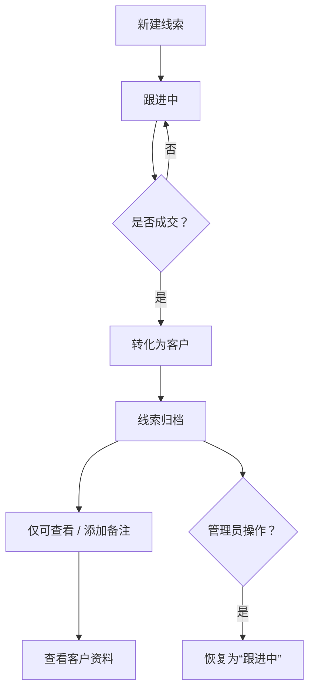

# 线索归档处理逻辑说明

> ❗关于线索归档与客户冲突说明：
>
> 在 CRM 项目设计初期，我们深入讨论了“是否应在客户转化后删除线索”的问题。
> 本系统采用“线索与客户分表+线索归档”的方案，其核心理由如下：
>
> - ✅ 保留业务历史链路，便于审计、绩效追踪与误归档修复；
> - ✅ 防止因客户信息清空而引发业务员争议或数据追溯困难；
> - ✅ 尤其在 SaaS 模式下，企业客户间共享同一平台，线索归属尤为敏感；
> - ✅ 在客户转化后仍能查看原线索信息，可防止业务员离职时客户信息难以追溯；
>
> 💡 我们明确禁止删除归档线索，并限制编辑关键信息，是为了从系统层面杜绝因操作不当引发的客户归属冲突，确保客户数据稳定性与公正性。

当线索转化为客户（即成交）后，该线索将进入“归档”状态，归档的线索将受到如下操作限制和支持：

## 一、归档后允许的操作

- ✅ 查看详情：可以查看线索的完整历史信息。
- ✅ 添加备注：允许补充跟进信息或修正备注内容。
- ✅ 跳转至客户资料页：可以快速访问已转化客户的完整信息。
- ✅ 管理员恢复状态：管理员可以将误归档的线索恢复为“未转化”状态。

## 二、归档后禁用的操作

- ❌ 禁止编辑关键信息（如客户姓名、来源、等级等）（防止归档后信息被篡改，确保历史数据的真实性，并降低客户归属争议风险）
- ❌ 禁止删除归档线索（保留业务数据完整性，避免客户历史丢失）
- ❌ 禁止再次转化（避免重复客户）（一旦转化为客户，应由客户模块统一维护，防止数据重复）

✅ 客户页面是否允许编辑？

- 默认允许在客户模块中编辑客户信息，便于完善资料和后续维护；
- 建议记录修改历史，并限制部分关键字段编辑（如姓名、UUID），以确保数据一致性；
- 重要字段如合同状态、支付信息应有专门权限控制。

## 三、角色权限控制建议

| 角色       | 是否可编辑归档线索 |
|------------|--------------------|
| 销售       | ❌ 不可编辑         |
| 销售主管   | ✅ 可查看、备注     |
| 管理员     | ✅ 可修改和恢复状态 |

> ⚠️ 此限制特别适用于企业多业务员操作场景，有助于防止线索重复、冲突和误删除。

## 四、技术实现建议

- 增加字段：`is_archived BOOLEAN DEFAULT FALSE`
- 或使用状态枚举：如 `status ENUM('new', 'following', 'converted', 'archived')`
- 前端判断 `converted` 或 `is_archived` 字段，控制按钮显隐和只读状态。

## 五、流程逻辑图

