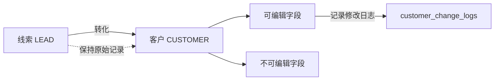
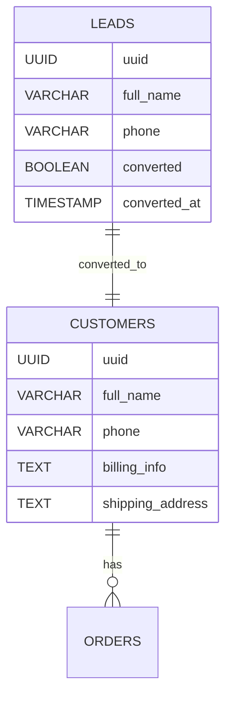

# 线索转客户的系统设计与决策记录

## 背景

在 CRM 系统设计中，客户数据的管理方式是一个复杂且高影响力的核心决策点。尤其是在“线索（leads）”向“客户（customers）”的转化过程中，涉及到业务流程、数据结构、权限控制、系统演进等多个维度。

本记录旨在总结我们团队对于“线索转客户”的结构方案选择、权衡逻辑、以及最终决策，作为今后开发与运维的重要参考。

---

## 最终方案：保留线索表与客户表，分离维护

### ✅ 核心理由：

1. **生命周期不同**：
   - 线索：初步接触、信息不完整、转化未定
   - 客户：已经成交、需要长期跟踪、需完整合同发票记录等

2. **字段结构差异大**：
   - 线索字段关注评分、渠道、来源、跟进
   - 客户字段关注地址、发票、合同、订单、历史数据

3. **权限与流程角色不同**：
   - 线索仅销售团队接触
   - 客户涉及财务、运营、客服等多个角色

4. **避免字段冗余和查询复杂度**
   - 客户字段不应污染线索数据，反之亦然

---

## 转化逻辑

- `leads` 表中的记录，一旦成交，将字段 `converted` 置为 `true`，并记录 `converted_at` 时间戳
- 系统通过后端脚本或触发器，将该条数据复制/映射至 `customers` 表，赋予完整信息结构
- `leads` 数据保留作为历史参考，不可删除，仅可归档
- 客户数据可继续维护，并形成独立订单、发票等业务链条

---

## 是否删除线索记录？

> ❌ 不删除。理由如下：

- 保留原始信息，便于事后分析转化路径、员工绩效、渠道质量
- 提高数据透明度，便于审计与追踪

---

## 是否可编辑线索数据？

> ⚠️ 一旦转化为客户后，线索数据设为“只读”状态：

- 防止历史数据被篡改
- 保障数据一致性
- 线索表中仅保留记录，不做业务修改

---

## 是否允许编辑客户数据？

> ✅ 客户数据允许编辑，但需明确控制范围与记录修改历史：

- 可编辑字段：
  - 发票信息（如税号、抬头）
  - 联系人信息（姓名、电话、邮箱）
  - 地址信息（收货、开票地址）
  - 客户等级、标签、跟进状态等

- 不可编辑字段建议：
  - 客户 UUID
  - 转化来源（对应线索 ID）
  - 创建时间

- 技术建议：
  - 建立修改日志表 `customer_change_logs`
  - 字段包括：字段名、原值、新值、修改人、修改时间

---

## 客户编辑权限控制建议

| 角色       | 是否可编辑客户资料 |
|------------|--------------------|
| 销售       | ✅ 可编辑部分字段     |
| 财务人员   | ✅ 可编辑发票字段     |
| 管理员     | ✅ 可编辑全部字段     |

---

## 客户编辑与线索数据一致性图（Mermaid）

---

## 客户数据是否允许编辑？

> ✅ 可编辑，但需记录修改历史，或做权限控制：
- 编辑发票信息、地址、联系人等
- 支持数据修正与更新

---

## 数据结构图（Mermaid）

---

## 小结

我们选择了两张表的设计逻辑，是基于业务清晰性、数据可维护性、权限划分的综合考量。这是一个 CRM 系统的核心模块设计，在中大型企业场景中尤其关键。

未来如需扩展客户类型（B端客户、C端客户）、或自动化转化逻辑，亦可在此基础上灵活演进。

---

## 客户唯一性与冲突问题探讨

在 CRM 系统实际应用中，客户唯一性判定是一个复杂且敏感的问题，特别在涉及多个销售人员、交叉市场、公司组织架构复杂的企业环境中尤为突出。

### ⚠️ 问题背景

- 一个客户可能以不同方式录入系统（如多个联系人、不同手机号）
- 公司名称可能存在简称、分公司、别名、错别字等多种形式
- 同一联系人可能为多个公司的联系人，或以不同身份出现

### 📌 常见的控制方式

1. **以手机号唯一（最常见）**
   - 优点：简单、易实现
   - 缺点：不适用于公司级管理、多联系人场景

2. **以公司名唯一**
   - 优点：适合 B2B 管理
   - 缺点：需处理公司重名、别名、合并拆分等情况

3. **营业执照编号唯一**
   - 优点：标准化
   - 缺点：用户不易提供，前期线索难以获取

4. **由专职信息管理员统一维护客户库**
   - 优点：确保数据质量
   - 缺点：效率低、流程复杂、依赖人力

### ✅ 我们的策略建议（当前版本）

- 系统允许重复客户录入，设置“潜在冲突标记”机制（如同手机号、相似公司名提示）
- 线索阶段不强制唯一，成交转客户前可引导合并校验
- 所有客户录入、转化、合并等操作需留存日志，便于追踪

### 📣 SaaS 场景下的重要性

作为提供 CRM 系统给第三方客户使用的 SaaS 平台，客户唯一性与客户争夺冲突将直接影响销售团队的信任与使用满意度，甚至可能成为是否采购系统的重要决策因素。因此：

- 我们需在产品说明文档中明确规则
- 提供“归属权定义”、“冲突提示”、“数据合并”相关工具与策略
- 在未来可支持客户归属权审批、争议申诉等机制