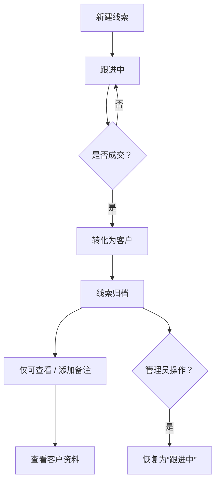

# 线索归档处理逻辑说明

当线索转化为客户（即成交）后，该线索将进入“归档”状态，归档的线索将受到如下操作限制和支持：

## 一、归档后允许的操作

- ✅ 查看详情：可以查看线索的完整历史信息。
- ✅ 添加备注：允许补充跟进信息或修正备注内容。
- ✅ 跳转至客户资料页：可以快速访问已转化客户的完整信息。
- ✅ 管理员恢复状态：管理员可以将误归档的线索恢复为“未转化”状态。

## 二、归档后禁用的操作

- ❌ 禁止编辑关键信息（如客户姓名、来源、等级等）（防止归档后信息被篡改，确保历史数据的真实性）
- ❌ 禁止删除归档线索（保留业务数据完整性，避免客户历史丢失）
- ❌ 禁止再次转化（避免重复客户）（一旦转化为客户，应由客户模块统一维护，防止数据重复）

✅ 客户页面是否允许编辑？

- 默认允许在客户模块中编辑客户信息，便于完善资料和后续维护；
- 建议记录修改历史，并限制部分关键字段编辑（如姓名、UUID），以确保数据一致性；
- 重要字段如合同状态、支付信息应有专门权限控制。

## 三、角色权限控制建议

| 角色       | 是否可编辑归档线索 |
|------------|--------------------|
| 销售       | ❌ 不可编辑         |
| 销售主管   | ✅ 可查看、备注     |
| 管理员     | ✅ 可修改和恢复状态 |

## 四、技术实现建议

- 增加字段：`is_archived BOOLEAN DEFAULT FALSE`
- 或使用状态枚举：如 `status ENUM('new', 'following', 'converted', 'archived')`
- 前端判断 `converted` 或 `is_archived` 字段，控制按钮显隐和只读状态。

## 五、流程逻辑图

