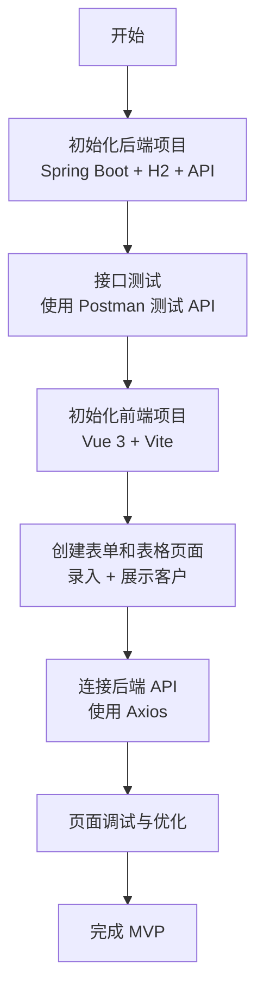
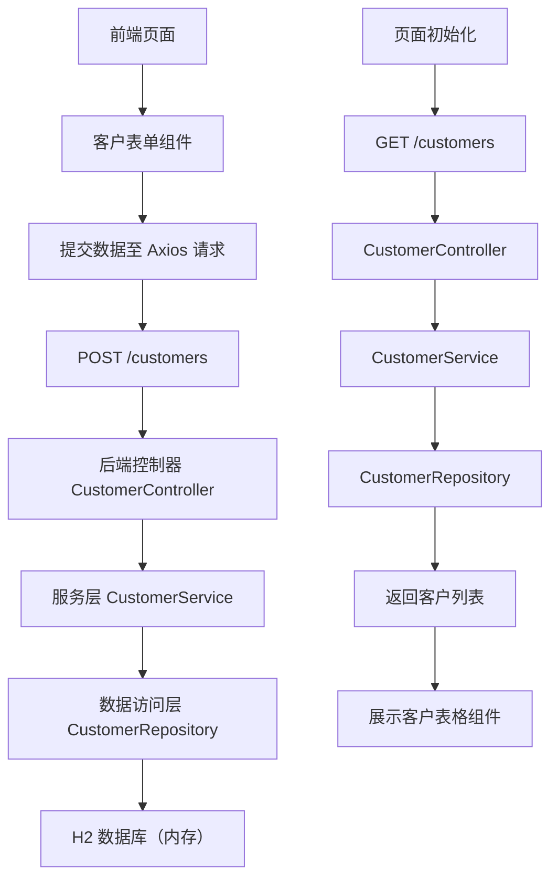

# 1小时内实现CRM系统最小MVP方案

## 🎯 开发目标（最小可行原型）

在 1 小时内构建一个最小版本的 CRM 系统，完成“客户录入 + 查询”这一最核心业务流程。

---

## ✅ MVP功能范围

### 后端（Spring Boot）：
- [x] 客户实体类（Customer）：包含姓名、手机号
- [x] REST API 接口：
  - `POST /customers`：新增客户
  - `GET /customers`：查询客户列表
- [x] 使用内存数据库 H2（避免配置MySQL）
- [x] 使用 Spring Data JPA 快速开发

### 前端（Vue 3）：
- [x] 简单页面 + 表单：输入姓名、手机号
- [x] Axios 请求保存客户
- [x] 客户列表展示表格

---

## 🛠 技术选型

| 层级 | 技术 |
|------|------|
| 后端框架 | Spring Boot 3.x |
| 数据库 | H2 内存数据库 |
| ORM | Spring Data JPA |
| 前端框架 | Vue 3 |
| 状态管理 | 无（不需要） |
| HTTP 请求 | Axios |
| UI组件 | Element Plus |
| 前端构建 | Vite |

---

## ⏱ 时间分配建议

| 时间 | 任务 | 工具 |
|------|------|------|
| 0-10分钟 | 初始化 Spring Boot 项目 + 实体类 + API 创建 | Spring Initializr + IDEA |
| 10-20分钟 | 启动服务 + Postman 测试 API 成功 | Postman / curl |
| 20-35分钟 | 初始化 Vue3 项目 + 创建客户表单 + 列表组件 | Vite + VSCode |
| 35-55分钟 | 实现前端调用 API 保存与展示 | Axios + Element Plus |
| 55-60分钟 | 简单调试美化 + 完成展示 | 浏览器预览 |

---

## ✅ 最终效果

- ✅ 客户信息录入成功
- ✅ 数据保存在内存数据库中
- ✅ 页面刷新后仍能看到客户列表（因为数据未清除）
- ✅ 前后端完整打通，验证可行性

---

## 🔚 小结

即使时间紧，只要规划清晰、目标聚焦，1 小时内依然可以完成一个能运行的 CRM MVP 系统，并为后续开发打下良好基础。

---

## 🔄 开发流程图（Mermaid）

## 🧩 模块流程图（Mermaid）

